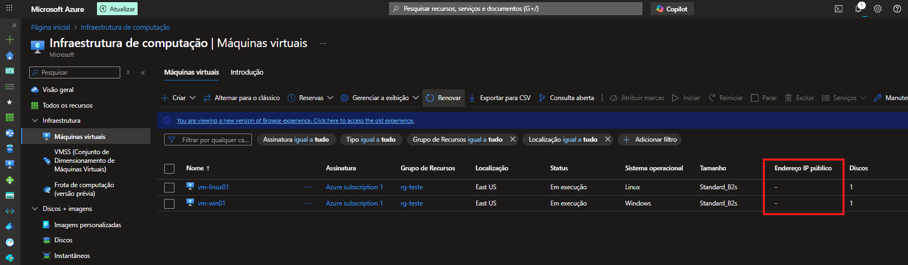
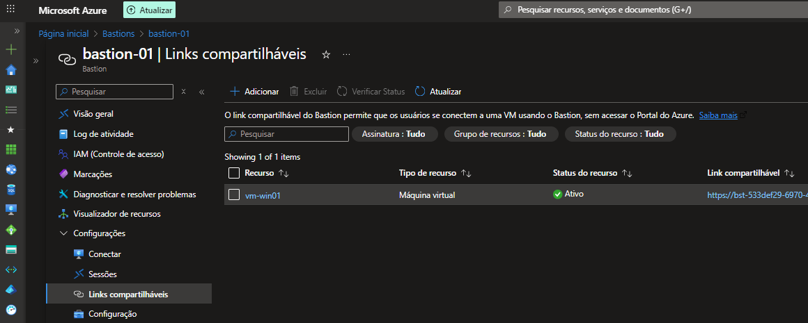
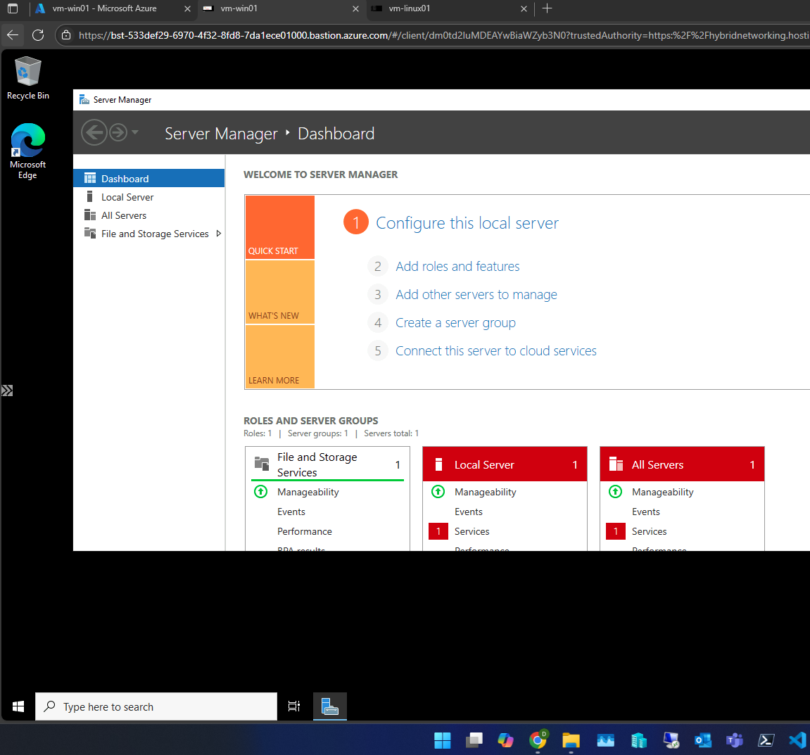
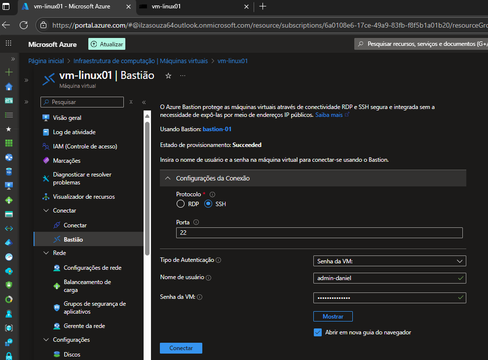

# Azure Bastion – Acesso Seguro a Máquinas Virtuais no Azure

Este repositório demonstra como utilizar o **Azure Bastion** para acessar máquinas virtuais Linux e Windows sem expor IPs públicos ou abrir portas como 22 (SSH) e 3389 (RDP), garantindo segurança e boas práticas de infraestrutura.

Toda a documentação é baseada em um laboratório real, acompanhado por prints armazenados em **bastion/imagens**.

---

## 🔍 O que é o Azure Bastion?

O **Azure Bastion** é um serviço PaaS que permite acesso seguro via RDP ou SSH diretamente pelo navegador, sem depender de:
- IP público nas VMs
- Jump Servers
- Portas expostas para a internet

Isso aumenta a segurança e reduz a superfície de ataque do ambiente.

---

## 🏗 Arquitetura do Laboratório

O ambiente contém:

- 1 Bastion Host (`bastion-01`)
- 1 VM Linux (`vm-linux01`)
- 1 VM Windows (`vm-win01`)
- Ambas **sem IP público**

### 📸 VMs sem IP público



---

## ⚙️ 1. Criando e configurando o Azure Bastion

Após provisionar, a tela de visão geral exibe os detalhes:


O Bastion precisa obrigatoriamente da subnet:
```
AzureBastionSubnet
```
Com a máscara mínima **/26**.

---

## 🔗 2. Usando Links Compartilháveis

Com links compartilháveis, é possível permitir acesso via Browser sem conceder acesso ao Portal Azure.



O usuário acessa uma interface de login como esta:


---

## 🖥️ 3. Acesso RDP (Windows) via Bastion

### Tela de conexão:



---

## 🐧 4. Acesso SSH (Linux) via Bastion



Suporta:
- Senha
- Chave SSH
- Sessão direta no navegador

---

## 🛡️ Benefícios

- Sem IP público nas VMs
- Sem abrir portas 22/3389
- Acesso privado dentro da VNet
- Cliente RDP/SSH direto no navegador
- Redução da superfície de ataque

---

## 📁 Estrutura do Repositório

```
README.md
bastion/
   imagens/
      bastion.png
      conexao.png
      link compartilhado .png
      link.png
      vm sem IP publicos.png
      win-conexao.png
```

---

## 📫 Contato

LinkedIn: https://www.linkedin.com/in/daniel-rodrigues-358b41121/
Email: daniel07.rodrigues@hotmail.com
